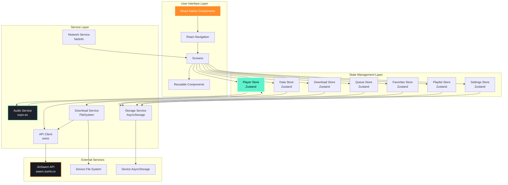
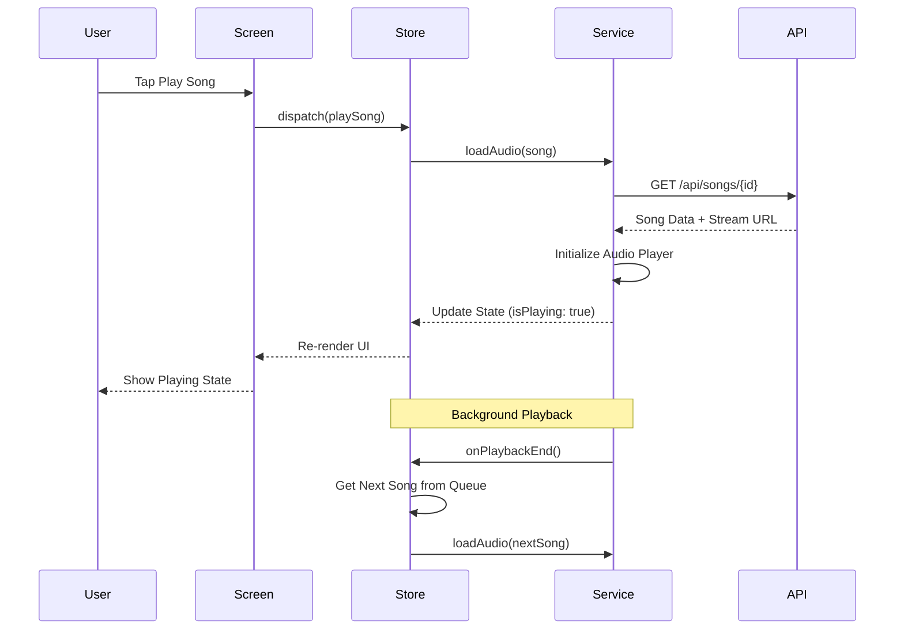
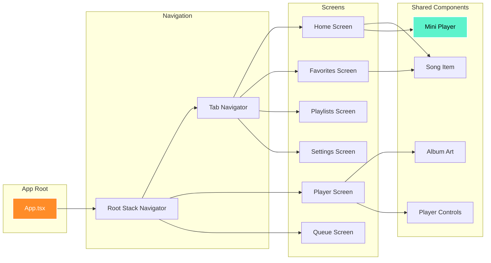

# Music Player App

A feature-rich React Native music streaming application built with Expo, integrating with the JioSaavn API. This app provides a seamless music listening experience with background playback, queue management, offline downloads, and a beautiful dark-themed UI.

## 📱 Features

### Core Features
- **Music Streaming**: Stream songs from JioSaavn API with high-quality audio
- **Search Functionality**: Search for songs, artists, and albums with real-time results
- **Full Player**: Complete playback controls with seek bar, album artwork, and song information
- **Mini Player**: Persistent bottom player synced across all screens
- **Background Playback**: Continue listening when the app is minimized or screen is off
- **Queue Management**: Add, reorder, and remove songs from the playback queue

### Advanced Features
- **Offline Downloads**: Download songs for offline playback with progress tracking
- **Shuffle & Repeat**: Multiple playback modes (shuffle, repeat all, repeat one)
- **Favorites**: Save your favorite songs for quick access
- **Playlists**: Create and manage custom playlists
- **Recently Played**: Track your listening history
- **Settings**: Customize audio quality, download preferences, and theme

## 🛠️ Technology Stack

### Core Technologies
- **Framework**: React Native with Expo (~55.0.6)
- **Language**: TypeScript (~5.9.2)
- **Navigation**: React Navigation v7 (Stack + Bottom Tabs)
- **State Management**: Zustand (^5.0.11)
- **Storage**: AsyncStorage (2.2.0)
- **Audio Playback**: expo-av (^16.0.8)

### Key Dependencies
- **UI Components**: @expo/vector-icons, expo-linear-gradient, expo-blur
- **Fonts**: @expo-google-fonts/poppins
- **Networking**: axios (^1.13.6), @react-native-community/netinfo
- **Gestures**: react-native-gesture-handler, react-native-reanimated
- **File System**: expo-file-system (for downloads)
- **Drag & Drop**: react-native-draggable-flatlist

## 📋 Prerequisites

Before you begin, ensure you have the following installed:
- Node.js (v18 or higher)
- npm or yarn
- Expo CLI (`npm install -g expo-cli`)
- Android Studio (for Android development) or Xcode (for iOS development)
- Physical device or emulator/simulator

## 🚀 Setup Instructions

### 1. Clone the Repository
```bash
git clone https://github.com/sammyZi/Zuno.git
cd music-player-app
```

### 2. Install Dependencies
```bash
npm install
# or
yarn install
```

### 3. Start the Development Server
```bash
npm start
# or
expo start
```

### 4. Run on Device/Emulator

#### Android
```bash
npm run android
# or
expo run:android
```

#### iOS
```bash
npm run ios
# or
expo run:ios
```

#### Web (for testing only)
```bash
npm run web
```

### 5. Scan QR Code
- Install Expo Go app on your physical device
- Scan the QR code displayed in the terminal or browser
- The app will load on your device

## 📁 Project Structure

```
music-player-app/
├── src/
│   ├── components/          # Reusable UI components
│   │   ├── common/         # Generic components (Button, LoadingSpinner, etc.)
│   │   ├── home/           # Home screen components
│   │   ├── player/         # Player components (MiniPlayer, PlayerControls, etc.)
│   │   ├── playlist/       # Playlist components
│   │   ├── queue/          # Queue management components
│   │   ├── search/         # Search components
│   │   └── song/           # Song-related components (SongItem, AlbumArt, etc.)
│   ├── hooks/              # Custom React hooks
│   │   └── usePlayback.ts  # Playback control hook
│   ├── navigation/         # Navigation configuration
│   │   ├── AppNavigator.tsx    # Root navigator
│   │   ├── TabNavigator.tsx    # Bottom tab navigator
│   │   └── types.ts            # Navigation types
│   ├── screens/            # Screen components
│   │   ├── HomeScreen.tsx
│   │   ├── PlayerScreen.tsx
│   │   ├── PlaylistsScreen.tsx
│   │   ├── FavoritesScreen.tsx
│   │   ├── SettingsScreen.tsx
│   │   └── ...
│   ├── services/           # External services
│   │   ├── api/           # API client and endpoints
│   │   ├── audio/         # Audio playback service
│   │   └── storage/       # Download and storage service
│   ├── store/             # Zustand state stores
│   │   ├── playerStore.ts     # Playback state
│   │   ├── queueStore.ts      # Queue management
│   │   ├── favoritesStore.ts  # Favorites
│   │   ├── playlistStore.ts   # Playlists
│   │   ├── downloadStore.ts   # Downloads
│   │   └── settingsStore.ts   # App settings
│   ├── theme/             # Design tokens
│   │   ├── colors.ts
│   │   ├── typography.ts
│   │   ├── spacing.ts
│   │   ├── borderRadius.ts
│   │   └── shadows.ts
│   ├── types/             # TypeScript type definitions
│   │   └── api.ts
│   └── utils/             # Utility functions
│       ├── audio.ts       # Audio helpers
│       └── network.ts     # Network utilities
├── assets/                # Static assets (images, fonts, etc.)
├── App.tsx               # Root component
├── app.json              # Expo configuration
├── package.json          # Dependencies
└── tsconfig.json         # TypeScript configuration
```

## 🏗️ Architecture

### System Architecture Overview



### Data Flow Architecture



### Component Architecture



### State Management Architecture

The app uses **Zustand** for state management, providing a simple and performant solution with minimal boilerplate. State is organized into focused stores:

1. **playerStore**: Manages current playback state (song, position, duration, play/pause)
2. **queueStore**: Manages playback queue with persistence (queue, shuffle, repeat modes)
3. **favoritesStore**: Manages favorite songs with AsyncStorage persistence
4. **playlistStore**: Manages user-created playlists
5. **downloadStore**: Tracks downloaded songs and download progress
6. **settingsStore**: Manages app settings (theme, audio quality, etc.)

**Why Zustand?**
- Minimal boilerplate compared to Redux
- Built-in TypeScript support
- Easy integration with React hooks
- Excellent performance with selective subscriptions
- Simple middleware for persistence

### Audio Playback Architecture

The app uses **expo-av** for audio playback with a custom AudioService wrapper:

1. **AudioService**: Singleton service managing the Audio.Sound instance
2. **Background Playback**: Configured with `staysActiveInBackground: true`
3. **Event Listeners**: Handles playback status updates and track completion
4. **Integration**: Tightly integrated with playerStore for state synchronization

**Why expo-av?**
- Native Expo integration (no additional native modules)
- Supports background playback out of the box
- Comprehensive API for audio control
- Cross-platform compatibility (iOS/Android)
- Built-in support for streaming URLs

### Navigation Architecture

The app uses **React Navigation v7** with a hybrid navigation structure:

```
Stack Navigator (Root)
├── Tab Navigator (Main)
│   ├── Home Tab
│   ├── Playlists Tab
│   ├── Favorites Tab
│   └── Settings Tab
├── Player Screen (Modal)
├── Queue Screen (Modal)
├── Artist Screen (Push)
└── Album Screen (Push)
```

**Why React Navigation v6+?**
- Industry standard for React Native navigation
- Excellent TypeScript support
- Flexible navigation patterns (stack, tabs, modals)
- Deep linking support
- Active community and maintenance

**Why NOT Expo Router?**
- Assignment requirement explicitly specified React Navigation
- More control over navigation structure
- Better suited for complex navigation patterns

### API Integration Architecture

The app integrates with the **JioSaavn API** (https://saavn.sumit.co):

1. **API Client**: Axios-based client with interceptors for error handling
2. **Endpoints**: Centralized endpoint definitions
3. **Type Safety**: Full TypeScript interfaces for API responses
4. **Error Handling**: Graceful error handling with user-friendly messages

**API Endpoints Used**:
- `/api/songs` - Fetch song list
- `/api/search/songs` - Search songs
- `/api/search/artists` - Search artists
- `/api/search/albums` - Search albums
- `/api/songs/{id}` - Get song details
- `/api/songs/{id}/suggestions` - Get song suggestions
- `/api/artists/{id}` - Get artist details
- `/api/albums/{id}` - Get album details

### Persistence Architecture

The app uses **AsyncStorage** for data persistence:

1. **Queue Persistence**: Automatically saves queue on every change
2. **Favorites Persistence**: Saves favorites list
3. **Playlist Persistence**: Saves user playlists
4. **Settings Persistence**: Saves user preferences
5. **Download Metadata**: Tracks downloaded songs

**Why AsyncStorage?**
- Built-in with React Native
- Simple key-value storage API
- Sufficient for app requirements
- No additional native dependencies
- Cross-platform support

## 🎨 Design System

The app follows a comprehensive design system based on the Figma reference:

### Color Palette
- **Primary Accent**: `#FF8C28` (Orange)
- **Secondary Accent**: `#5EF3CC` (Cyan)
- **Background Primary**: `#181A20` (Dark)
- **Background Secondary**: `#1F222A` (Card background)
- **Text Primary**: `#FFFFFF`
- **Text Secondary**: `#FAFAFA`
- **Error**: `#E22134`

### Typography
- **Font Family**: Poppins (Google Fonts)
- **Weights**: Regular (400), Medium (500), SemiBold (600), Bold (700)
- **Sizes**: 10px - 28px with consistent line heights

### Spacing
- Based on 8px grid system
- Consistent spacing: 4px, 8px, 16px, 24px, 32px, 48px, 64px

### Components
- Rounded corners (6px, 12px, 16px, 20px)
- Consistent shadows for elevation
- Icon set from Ionicons

## ⚖️ Trade-offs and Technical Decisions

### 1. Zustand vs Redux Toolkit

**Decision**: Chose Zustand

**Rationale**:
- **Pros**: Simpler API, less boilerplate, better TypeScript support, smaller bundle size
- **Cons**: Less ecosystem tooling compared to Redux
- **Trade-off**: Sacrificed Redux DevTools integration for development simplicity and performance

### 2. expo-av vs react-native-track-player

**Decision**: Chose expo-av

**Rationale**:
- **Pros**: Native Expo integration, no additional setup, cross-platform consistency
- **Cons**: Less advanced features (no media controls in lock screen on some devices)
- **Trade-off**: Sacrificed some advanced features for easier setup and maintenance

### 3. AsyncStorage vs MMKV

**Decision**: Chose AsyncStorage

**Rationale**:
- **Pros**: Built-in, no native dependencies, sufficient performance for app needs
- **Cons**: Slower than MMKV for large datasets
- **Trade-off**: Acceptable performance trade-off for simpler setup and no additional dependencies

### 4. React Navigation vs Expo Router

**Decision**: Chose React Navigation

**Rationale**:
- **Pros**: Assignment requirement, more mature, better documentation
- **Cons**: More boilerplate than Expo Router
- **Trade-off**: N/A - requirement-driven decision

### 5. Single Queue vs Multiple Playlists

**Decision**: Implemented both

**Rationale**:
- **Pros**: Better user experience, more flexibility
- **Cons**: More complex state management
- **Trade-off**: Added complexity for enhanced functionality

### 6. Optimistic UI Updates vs Server Confirmation

**Decision**: Optimistic updates with local persistence

**Rationale**:
- **Pros**: Instant feedback, better UX, works offline
- **Cons**: Potential sync issues if API changes
- **Trade-off**: Better UX at the cost of potential edge case bugs

### 7. Image Caching Strategy

**Decision**: Rely on React Native's built-in image caching

**Rationale**:
- **Pros**: No additional dependencies, automatic cache management
- **Cons**: Less control over cache size and expiration
- **Trade-off**: Simpler implementation with acceptable performance

## 🎯 Extra Features Implemented

Beyond the core requirements, the following features were added:

1. **Favorites System**: Save and manage favorite songs
2. **Custom Playlists**: Create, edit, and delete playlists
3. **Recently Played**: Track listening history
4. **Downloads Screen**: Dedicated screen for managing offline downloads
5. **Search Enhancements**: Search across songs, artists, and albums with categorized results
6. **Settings Screen**: Comprehensive settings for audio quality, downloads, and preferences
7. **Network Status**: Display network connectivity status
8. **Error Boundaries**: Graceful error handling throughout the app
9. **Loading States**: Skeleton screens and loading indicators
10. **Empty States**: User-friendly empty state messages
11. **Pull-to-Refresh**: Refresh content on home screen
12. **Haptic Feedback**: Tactile feedback for button presses
13. **Gradient Backgrounds**: Beautiful gradient effects on player screen
14. **Blur Effects**: Backdrop blur on modals and overlays

## 📸 Screenshots

> **Note**: Screenshots will be added here after the app is fully tested on a physical device.

### Home Screen
- Light and dark theme
- Song list with search
- Category tabs (Suggested, Songs, Artists, Albums)

### Player Screen
- Full-screen player with album artwork
- Playback controls (play, pause, next, previous)
- Seek bar with time display
- Shuffle and repeat buttons
- Download button with progress

### Mini Player
- Persistent bottom bar
- Current song information
- Play/pause control
- Tap to expand to full player

### Queue Screen
- Current queue display
- Drag-and-drop reordering
- Delete songs from queue
- Clear queue button

### Other Screens
- Favorites list
- Playlists management
- Settings
- Search results
- Downloads

## 🐛 Known Issues and Limitations

### Current Limitations

1. **Lock Screen Controls**: Media controls on lock screen may not work on all Android devices due to expo-av limitations
2. **Download Progress**: Download progress may not update in real-time on slower connections
3. **Search Debouncing**: Search may feel slightly delayed on very slow networks
4. **Image Loading**: Album artwork may take time to load on slow connections
5. **Background Playback**: On some Android devices, background playback may stop after extended periods due to battery optimization

### Future Improvements

1. **Lyrics Support**: Add synchronized lyrics display
2. **Equalizer**: Add audio equalizer with presets
3. **Social Features**: Share songs and playlists with friends
4. **Sleep Timer**: Add sleep timer for automatic playback stop
5. **Crossfade**: Add crossfade between tracks
6. **Gapless Playback**: Implement gapless playback for albums
7. **Chromecast Support**: Add casting to external devices
8. **Collaborative Playlists**: Allow multiple users to edit playlists
9. **Advanced Search**: Add filters for year, language, genre
10. **Performance Optimization**: Further optimize list rendering and image loading

### Bug Fixes Needed

- [ ] Fix occasional sync delay between mini player and full player
- [ ] Improve error handling for network timeouts
- [ ] Fix queue persistence edge cases
- [ ] Optimize memory usage for large playlists
- [ ] Fix occasional crash on rapid screen transitions

## 📚 API Documentation

### JioSaavn API Reference

**Base URL**: `https://saavn.sumit.co`

#### Endpoints

##### Get Songs
```
GET /api/songs?page={page}&limit={limit}
```
Returns a paginated list of songs.

##### Search Songs
```
GET /api/search/songs?query={query}&page={page}&limit={limit}
```
Search for songs by name, artist, or album.

##### Get Song Details
```
GET /api/songs/{id}
```
Get detailed information about a specific song.

##### Get Song Suggestions
```
GET /api/songs/{id}/suggestions
```
Get suggested songs based on a song ID.

##### Search Artists
```
GET /api/search/artists?query={query}
```
Search for artists.

##### Get Artist Details
```
GET /api/artists/{id}
```
Get detailed information about an artist.

##### Search Albums
```
GET /api/search/albums?query={query}
```
Search for albums.

##### Get Album Details
```
GET /api/albums/{id}
```
Get detailed information about an album.

### Response Types

All API responses follow this structure:

```typescript
interface ApiResponse<T> {
  status: string;
  data: T;
}

interface Song {
  id: string;
  name: string;
  duration: number;
  language: string;
  album: {
    id: string;
    name: string;
    url?: string;
  };
  artists: {
    primary: Array<{
      id: string;
      name: string;
    }>;
  };
  image: Array<{
    quality: string;
    url: string;
  }>;
  downloadUrl: Array<{
    quality: string;
    url: string;
  }>;
}
```

## 🧪 Testing

### Manual Testing Checklist

- [ ] Home screen loads songs from API
- [ ] Search functionality works correctly
- [ ] Song playback starts when tapped
- [ ] Play/pause controls work
- [ ] Next/previous buttons work
- [ ] Seek bar updates and seeking works
- [ ] Mini player displays current song
- [ ] Mini player syncs with full player
- [ ] Background playback continues when app minimized
- [ ] Queue management (add, reorder, remove)
- [ ] Queue persists across app restarts
- [ ] Shuffle mode randomizes playback
- [ ] Repeat modes work correctly
- [ ] Download functionality works
- [ ] Offline playback works without internet
- [ ] Favorites can be added/removed
- [ ] Playlists can be created/edited/deleted
- [ ] Settings persist across app restarts
- [ ] App works on different screen sizes
- [ ] App handles network errors gracefully

### Performance Testing

- [ ] App maintains 60fps during scrolling
- [ ] Memory usage stays under 150MB
- [ ] App responds to user input within 100ms
- [ ] Search results appear within 2 seconds
- [ ] Song playback starts within 1 second

## 🚢 Building for Production

### Android APK

1. Configure app.json with proper package name and version
2. Build the APK:
```bash
eas build --platform android --profile preview
```

3. Or build locally:
```bash
expo build:android
```

### iOS IPA

```bash
eas build --platform ios --profile preview
```

## 📄 License

This project is created as part of an internship assignment and is for educational purposes only.

## 👥 Credits

- **Developer**: [Your Name]
- **Design Reference**: Figma - Lokal Music Player App UI Kit
- **API**: JioSaavn API (https://saavn.sumit.co)
- **Icons**: Ionicons
- **Fonts**: Google Fonts (Poppins)

## 📞 Support

For issues or questions, please contact [your-email@example.com]

---

**Built with ❤️ using React Native and Expo**
